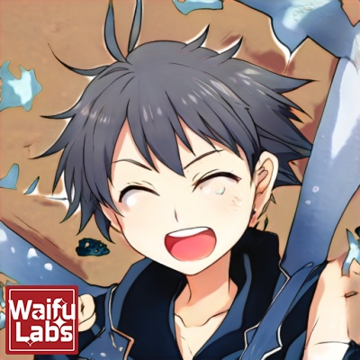

<!-- Thanks：https://github.com/sun0225SUN/sun0225SUN -->
<!-- Thanks：https://github.com/DenverCoder1/readme-typing-svg -->
<!-- Thanks：https://github.com/badges/shields -->
<!-- Thanks：https://komarev.com/ -->
<!-- Thanks：https://github.com/zonemeen/netease-recent-profile -->
<!-- Thanks：https://cdn.jsdelivr.net/ -->

<!-- Header -->

  <!-- Avatar -->
  

    ;
  
&emsp;&emsp;&emsp;

  <!-- Typing String -->
  

    
  

  <!-- profile -->
  

    <!-- Blog -->
    &emsp;
    <!-- Email -->
    &emsp;
    <!-- visitor statistics logo -->
    
  

<!-- About Me -->
# 🤵个人简介
- 🤡 工作方向：嵌入式软件工程师 - 图显驱动开发
- 🏫 毕业专业：自动化
- 💼 就职公司：Allwinner
- 📆 工作年限：4 年

---

# 💻技能简介
编程语言：

操作系统：

常用工具：

技术栈：
- [x] BSP 支持
- [x] 图形显示开发
- [x] Linux & Android & RTOS 驱动开发
- [x] Python & Shell 测试脚本编写
- [x] 应用层开发 (驱动demo)
- [x] 硬件调试

<!-- 其他展示 -->

  <!-- netease-recent-profile -->
  

    
  

  <!-- Top languages -->
  

    
  

  <!-- Github Streak Stats -->
  

    
  

